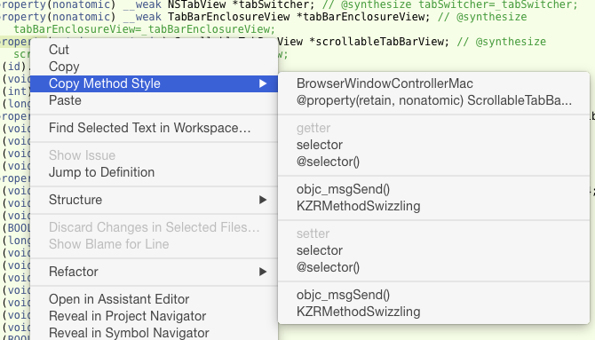

# CopyMethodStyle

CopyMethodStyle is plugin for Xcode 6.1  
This plugin adds menu to context menu on method declaration.  
The menu copies method as various style.
This plugin supports only Objective-C.

##Features

- Copy class name
- Copy expression
- Copy as selector or `@selector()` or `NSSelectorFromString()`
- Copy as `objc_msgSend()` snippet
- Copy as Symbolic Breakpoint expression
- Copy as [KZRMethodSwizzling](https://github.com/hetima/KZRMethodSwizzling) macro snippet
- Support property getter/setter
- Honding Alt key to change style variation

##Installation
Download project, build, relaunch Xcode.
CopyMethodStyle.xcplugin will be installed in
 `~/Library/Application Support/Developer/Shared/Xcode/Plug-ins`

## Author
http://hetima.com/  
https://twitter.com/hetima

## License 
MIT License. Copyright (c) 2014 hetima
